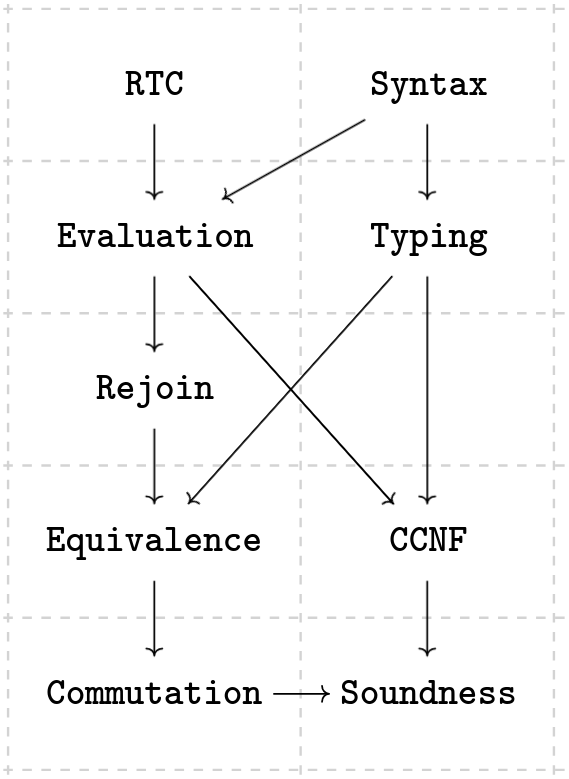

# Commuting Conversion Normalization for Call-by-Push-Value

This is a proof development on a compiler pass for call-by-push-value
that normalizes CBPV with respect to commuting conversions
using join points and jumps.
It uses a single unified syntax combining plain CBPV without join points
and CCNF CBPV with join points.

```
A ::= ⊤ | A + A | U B
B ::= A → B | B & B | F A

Γ ::= • | Γ, x : A
Δ ::= • | Δ, j : A ↗ B

v ::= x | () | inl v | inr v | {m}
m ::= v! | λx. m | m v | return v | let x ← m in m
  | case v of {inl x ⇒ m; inr x ⇒ m}
  | ⟨m, m⟩ | fst m | snd m
  | join j x = m in m | jump j v
```

CCNF is then proven a posteriori,
which splits computations into tail-free computations and configurations.

```
n ::= v! | λx. m | n v | return v | ⟨m, m⟩ | fst n | snd n
m ::= n | let x ← n in m | case v of {inl x ⇒ m; inr x ⇒ m}
  | join j x = m in m | jump j v
```

## Development structure and dependency graph

The structure of the proofs begins with the usual basics.

* RTC.lean: Reflexive, transitive closure of binary relations
* Syntax.lean: Syntax, renaming, substitution, and contexts
* Typing.lean: Typing rules, renaming, and weakening
* Evaluation.lean: Small-step evaluation of (closed) computations,
  which doesn't evaluate under binders and branches
* CK.lean: CK machine semantics, with soundness and completeness
  with respect to small-step, big-step, and equivalence

Showing that commuting conversions are valid is done
through a logical equivalence.

* Rejoin.lean: A proof widget for closing over jump contexts.
* Equivalence.lean: The logical equivalence defined over CBPV types,
  and the semantic equivalence closing over value and jump contexts.
* Commutation.lean: Well-typed commutations are semantically equivalent.

Commuting conversions are incorporated into the single-pass transformation
that resembles A-normalization, taking an auxiliary continuation `K`.

```
K ::= □ | let x ← □ in m | K :: □ v | K :: fst □ | K :: snd □
```

* CCNF.lean: CC-normalization and showing that it produces CCNF
  and that it preserves typing.
* Soundness.lean: Semantic equivalence of continuations,
  and showing that plugging a term into a continuation
  is semantically equivalent to translating it with an equivalent continuation.

We can also translate *into* CBPV, but these aren't related to CCNF.

* CBV.lean, CBN.lean: Translations from STLC with fine-grained CBV and CBN semantics,
  along with proofs that they preserve well-typedness and CK machine semantics.



## When to `@[simp]` and `@[reducible]`

Not all definitions are added to the default `simp` set.
As a general rule, a definition should be added if it is not a type-level term
and:

* It matches on an argument; or
* It does not match on an argument, but is not used in other definitions.

For instance, `Syntax.cons` matches on naturals,
and we want it to be in the simp set so that it reduces on constructors.
However, `Syntax.lift` doesn't match on an argument and is used in `Syntax.renameCom`,
so we don't want it to be in the simp set,
since it will always reduce too far when simplifying `renameCom`,
and prevent theorems about `renameCom` and `lift` from applying.
As another example, `Equivalence.semCtxt` is used within `Equivalence.semCom`,
so it shouldn't be in the simp set, but `semCom` itself can be.

Type-level definitions, especially recursive ones,
often represent predicates that could otherwise be encoded as inductives.
`Equivalence.𝒱` and `Equivalence.𝒞` are such definitions,
in contrast with their inductive versions.
The definitions should be explicitly unfolded as needed,
corresponding with invoking `cases` on the corresponding inductives.
Otherwise, simplification may again reduce too far
and prevent theorems from applying.

Type-level definitions which are just type aliases
should be marked as `@[reducible]` so that instances for typeclasses
on the aliased types can be used.
In particular, definitions consisting of applications of `RTC.RTC`
need to be `@[reducible]` so that `calc` can find the `Trans` instances.
